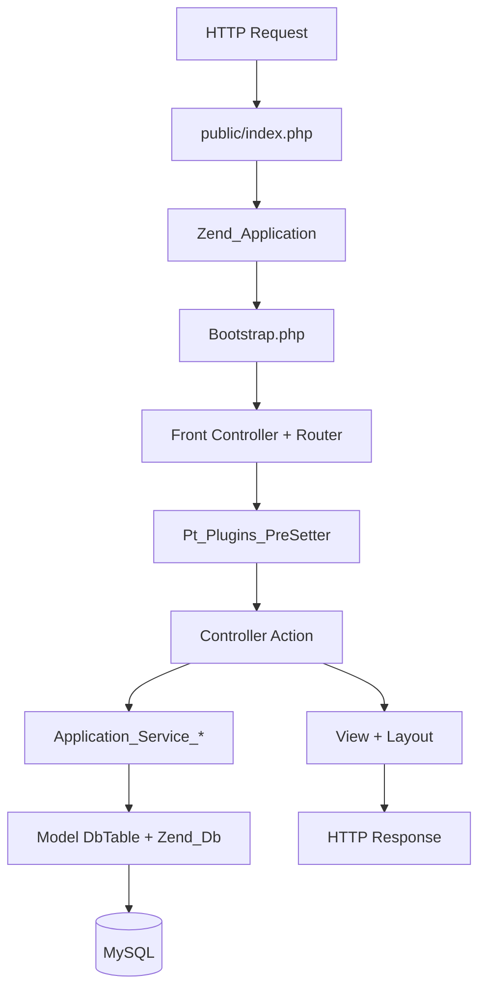
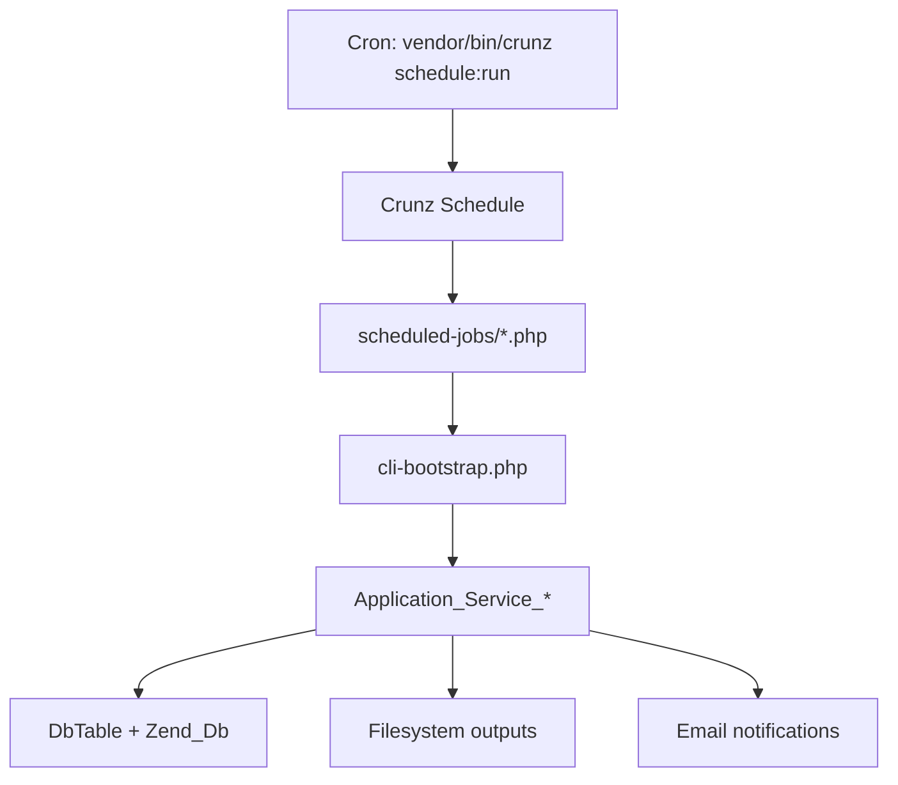

# ePT Code Architecture (PHP 8.4 + Zend Framework 1)

This document describes the high-level structure and execution flow of the ePT codebase.

## High-level overview

- Zend Framework 1 (ZF1) MVC app with default module plus `admin`, `api`, and `reports` modules.
- Controllers orchestrate requests and delegate to service classes (`application/services`).
- Service classes use ZF1 `Zend_Db_Table` models (`application/models/DbTable`) and other models.
- Views live under `application/views` and module-specific `application/modules/*/views`, with layouts under `application/layouts`.
- Background work runs via Crunz scheduled jobs in `scheduled-jobs/`.

## Entry points

- Web: `public/index.php`
- CLI bootstrap (used by scripts/jobs): `cli-bootstrap.php`
- Scheduled tasks: `scheduled-jobs/ScheduledTasks.php` (Crunz)
- CLI utilities: `bin/*.php`, `db-tools.php`, `runner/`

## Request lifecycle (web)



### Bootstrap responsibilities

- Loads configuration from `application/configs/application.ini`.
- Starts session, sets timezone, initializes CSRF token.
- Configures routes for captcha and downloads.
- Sets a default metadata cache for `Zend_Db_Table`.
- Initializes translation (`application/languages`).

### Front controller plugin

- `library/Pt/Plugins/PreSetter.php` enforces:
  - CSRF checks on requests.
  - Authentication rules for default vs admin/report modules.
  - Layout switching for admin/report contexts.

## Modules and controllers

- Default module controllers live in `application/controllers`.
- Module controllers live in `application/modules/{admin,api,reports}/controllers`.
- Common patterns:
  - Controllers call service layer classes like `Application_Service_Common`, `Application_Service_Shipments`.
  - Services call `Application_Model_DbTable_*` for persistence.

## Service layer

- Located in `application/services/`.
- Contains business logic for:
  - Shipments, participants, evaluations, reports, security, etc.
- Encourages reuse across web, API, and scheduled jobs.

## Data access

- `application/models/DbTable/*` uses `Zend_Db_Table_Abstract` conventions.
- Configured via `resources.db.*` in `application/configs/application.ini`.
- Database schema and utilities live under `database/` and `db-tools.php`.

## Configuration

- `application/configs/application.ini`:
  - ZF1 bootstrap settings, DB connection, module paths, mail settings.
- `application/configs/config.ini`:
  - Domain-specific defaults (evaluation thresholds, site content, locale).
- `constants.php`:
  - Global paths and version.

## Scheduled jobs

Crunz executes task definitions in `scheduled-jobs/ScheduledTasks.php`.



Key job scripts:

- `scheduled-jobs/generate-shipment-reports.php`
- `scheduled-jobs/evaluate-shipments.php`
- `scheduled-jobs/send-emails.php`
- `scheduled-jobs/execute-job-queue.php` (runs queued tasks stored in DB)

## Library and helpers

- Custom libraries live under `library/Pt`.
- Notable areas:
  - `Pt/Plugins` (request-level hooks)
  - `Pt/Helper/View` (view helpers)
  - `Pt/Reports` (report generation helpers)

## Assets and public files

- Public entry and assets under `public/`.
- Uploads and temporary files under:
  - `public/uploads`
  - `public/temporary`

## Directory map (partial)

```
application/
  Bootstrap.php
  configs/
  controllers/
  layouts/
  models/
    DbTable/
  modules/
    admin/
    api/
    reports/
  services/
  views/

library/
  Pt/

public/
  index.php
  assets/ css/ js/ images/

scheduled-jobs/
  ScheduledTasks.php
  *.php

bin/
  *.php
```

## Notes for maintainers

- ZF1 modules share the same services/models; avoid duplicating business logic in controllers.
- Prefer adding new shared behavior in `application/services` and keep controllers thin.
- Use `cli-bootstrap.php` for any new CLI tooling that needs ZF1 configs/services.
