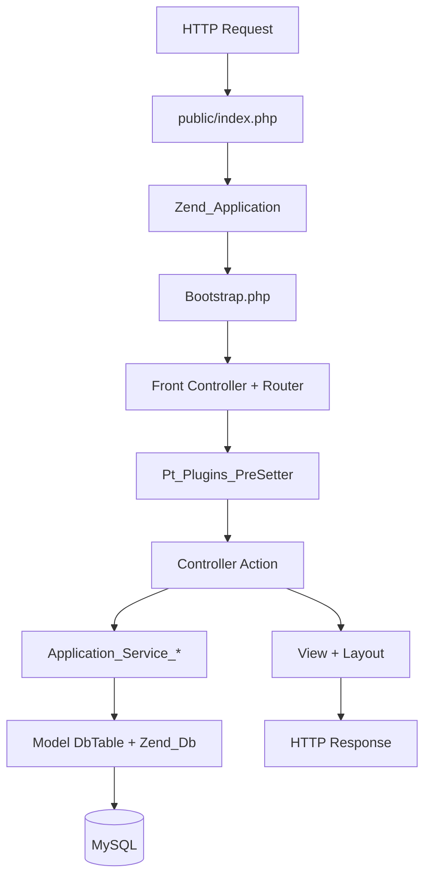
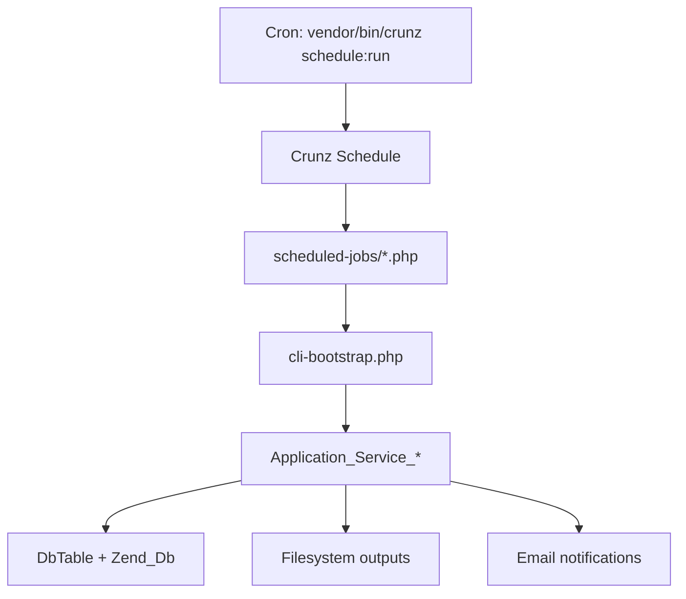

# ePT Code Architecture (PHP 8.4 + Zend Framework 1)

This document describes the high-level structure and execution flow of the ePT codebase.

## High-level overview

- Zend Framework 1 (ZF1) MVC app with default module plus `admin`, `api`, and `reports` modules.
- Controllers orchestrate requests and delegate to service classes (`application/services`).
- Service classes use ZF1 `Zend_Db_Table` models (`application/models/DbTable`) and other models.
- Views live under `application/views` and module-specific `application/modules/*/views`, with layouts under `application/layouts`.
- Background work runs via Crunz scheduled jobs in `scheduled-jobs/`.
- Multi-scheme support: DTS, VL, EID, TB, Recency, and Generic test types.

## Entry points

- Web: `public/index.php`
- CLI bootstrap (used by scripts/jobs): `cli-bootstrap.php`
- Scheduled tasks: `scheduled-jobs/ScheduledTasks.php` (Crunz)
- CLI utilities: `bin/*.php`, `db-tools.php`, `runner/`

## Request lifecycle (web)



### Bootstrap responsibilities

- Loads configuration from `application/configs/application.ini`.
- Starts session, sets timezone, initializes CSRF token.
- Configures routes for captcha and downloads.
- Sets a default metadata cache for `Zend_Db_Table`.
- Initializes translation (`application/languages`).

### Front controller plugin

- `library/Pt/Plugins/PreSetter.php` enforces:
  - CSRF checks on requests.
  - Authentication rules for default vs admin/report modules.
  - Layout switching for admin/report contexts.

## Security

### CSRF protection

`Application_Service_SecurityService` handles CSRF tokens:

- Generates 64-character tokens via `bin2hex(random_bytes(32))`.
- Stored in session namespace `csrf`.
- Validates POST/PUT/PATCH/DELETE requests using timing-safe `hash_equals()`.
- Token source: `X-CSRF-Token` header or `csrf_token` POST parameter.
- Exempt: CLI requests, XHR, API module, error controller.

### Authentication

Session-based authentication using `Zend_Session_Namespace`:

- **Data managers** (participants): `datamanagers` session namespace.
- **Administrators**: `administrators` session namespace.
- Features:
  - Email verification workflow.
  - Login attempt ban system (configurable temp/permanent bans).
  - Force password reset capability.
  - CAPTCHA verification before login.
  - Session tracking via `UserLoginHistory`.

### Authorization

`Pt_Plugins_PreSetter` enforces access control:

- Frontend access requires `datamanagers` session.
- Admin module access requires `administrators` session.
- Admins can access specific frontend URIs: `/dts/response`, `/eid/response`, `/vl/response`, `/tb/response`, `/recency/response`, `/generic-test/response`, `/tb/assay-formats`.
- Unauthenticated users redirected to login.
- Disabled for: error controller, auth controller, captcha, shipment-form.

### Input validation

- `Pt_Commons_MiscUtility`: Sanitization utilities.
  - `sanitizeFilename()`: Regex-based filename sanitization.
  - `toUtf8()`: Recursive UTF-8 encoding conversion.
  - `cleanString()`: Removes invisible Unicode characters, BOM, ZWSP.
- `Application_Service_Common::parseRecipients()`: Email validation with comma/semicolon splitting.
- Email validation via `filter_var(FILTER_VALIDATE_EMAIL)`.

## Modules and controllers

- Default module controllers live in `application/controllers`.
- Module controllers live in `application/modules/{admin,api,reports}/controllers`.
- Common patterns:
  - Controllers call service layer classes like `Application_Service_Common`, `Application_Service_Shipments`.
  - Services call `Application_Model_DbTable_*` for persistence.

## Service layer

- Located in `application/services/`.
- Contains business logic for:
  - Shipments, participants, evaluations, reports, security, etc.
- Encourages reuse across web, API, and scheduled jobs.

## Data access

- `application/models/DbTable/*` uses `Zend_Db_Table_Abstract` conventions.
- Configured via `resources.db.*` in `application/configs/application.ini`.
- Database schema and utilities live under `database/` and `db-tools.php`.

## Error handling and logging

### Error controller

`application/controllers/ErrorController.php` handles application errors:

- **404 errors**: `EXCEPTION_NO_ROUTE`, `EXCEPTION_NO_CONTROLLER`, `EXCEPTION_NO_ACTION`.
- **500 errors**: All other application exceptions.
- Logs errors with priority levels (NOTICE for 404, CRIT for 500).
- Conditionally displays stack traces based on `displayExceptions` config.

### Logging

`library/Pt/Commons/LoggerUtility.php` provides application logging via Monolog:

- Rotating file handler with 30-day retention.
- Log file: `/logs/logfile.log` with date format `Y-m-d`.
- Fallback to stderr if logs directory not writable.
- Static methods: `logError()` and `logInfo()`.
- Auto-captures caller file/line information via backtrace.

## Caching

### File-based cache (default)

Configured in `application/Bootstrap.php`:

- Backend: File-based (`application/cache/`).
- Lifetime: Extended (7200000000 seconds).
- Used for `Zend_Db_Table` metadata caching.

### Redis cache (optional)

`library/Pt/Cache/Backend/Redis.php` provides Redis caching:

- Custom `Zend_Cache` backend implementation.
- Tag-based caching support.
- TTL management via Redis expiration.
- Transaction support (`multi()`/`exec()`).
- Key prefixing for namespace isolation.

## Configuration

- `application/configs/application.ini`:
  - ZF1 bootstrap settings, DB connection, module paths, mail settings.
- `application/configs/config.ini`:
  - Domain-specific defaults (evaluation thresholds, site content, locale).
- `constants.php`:
  - Global paths and version.

## Scheduled jobs

Crunz executes task definitions in `scheduled-jobs/ScheduledTasks.php`.



### Job schedule

| Job | Frequency | Purpose |
|-----|-----------|---------|
| `generate-shipment-reports.php` | Every minute | Report generation |
| `execute-job-queue.php` | Every minute | Job queue processor |
| `send-emails.php` | Every minute | Email queue processor |
| `reset-stale-jobs.php` | Every 15 min | Stale job recovery |
| `db-tools backup` | Daily 00:45 | Database backup |
| `db-tools purge-binlogs` | Daily 04:05 | MySQL binary log cleanup |

### Job queue

`Application_Model_DbTable_ScheduledJobs` manages the `scheduled_jobs` table:

- Statuses: `pending` → `processing` → `completed`.
- Jobs scheduled via: `scheduleCertificationGeneration()`, `scheduleEvaluation()`.
- `execute-job-queue.php` fetches pending jobs (FIFO) and executes via shell.

## Email infrastructure

### Email queue

`Application_Model_DbTable_TempMail` manages the `temp_mail` table:

- Statuses: `pending` → `picked-to-process` → `sent`/`failed`/`not-sent`.
- Failure types: `smtp-auth`, `connectivity`, `bad-recipient`, `rate-limit`, `content`, `other`.

### Email sending

`scheduled-jobs/send-emails.php` processes the email queue:

- Uses Symfony Mailer (replaces Zend_Mail).
- Batches recipients (To + Cc + Bcc) up to 100 per email.
- File-based lock (`/tmp/ept_mail_cron.lock`) with 10-minute TTL.
- Attachments: 15MB per file limit, 22MB total per message.

### Configuration

Mail settings stored in `system_config.mail` (JSON):

```json
{
  "host": "smtp.example.com",
  "port": 587,
  "username": "...",
  "password": "...",
  "ssl": "tls",
  "fromEmail": "...",
  "fromName": "ePT System"
}
```

### Health monitoring

`Application_Service_Common::getEmailHealthStatus()` tracks failure rates:

- Configurable window (default 7 days).
- Severity levels: ok, warning (>5%), critical (>15%).

## API module

### Structure

API controllers in `application/modules/api/controllers/`:

- `LoginController`: Authentication, password reset.
- `ShipmentsController`: Shipment data endpoints.
- `ParticipantController`: Participant data endpoints.
- `InitController`: Initialization/setup.
- `AggregatedInsightsController`: Analytics/reporting.

### Response format

- JSON-only responses (no XML).
- Request parsing: `json_decode(file_get_contents('php://input'))`.
- Response: `json_encode($result, JSON_PRETTY_PRINT)`.

### API services

`Application_Service_ApiServices` provides:

- Authentication via `authToken`.
- Data marshaling for all test schemes (DTS, VL, EID, TB, Recency, Generic).
- Reference data: test kits, possible results, not-tested reasons.

## Database migrations

### Migration system

`bin/migrate.php` handles database migrations:

- SQL-based migrations in `database/migrations/`.
- Version tracking via `system_config.app_version`.
- Uses `version_compare()` to run only newer migrations.
- Idempotent DDL helper functions.
- Flags: `--dry-run`, `-y` (auto-continue), `-q` (quiet).

### Run-once scripts

`bin/run-once.php` executes one-time setup scripts:

- Tracking table: `run_once_scripts`.
- Idempotent execution prevention.

## Library and helpers

- Custom libraries live under `library/Pt`.
- Notable areas:
  - `Pt/Plugins` (request-level hooks)
  - `Pt/Helper/View` (view helpers)
  - `Pt/Reports` (report generation helpers)
  - `Pt/Commons` (utilities: logging, sanitization)
  - `Pt/Cache` (Redis backend)

## Assets and public files

- Public entry and assets under `public/`.
- Uploads and temporary files under:
  - `public/uploads`
  - `public/temporary`

## Directory map

```
application/
  Bootstrap.php           # Application initialization
  cache/                  # File-based cache storage
  configs/
    application.ini       # ZF1 settings, DB, mail
    config.ini            # Domain-specific defaults
  controllers/            # Default module controllers
  languages/              # Translation files
  layouts/                # View layouts
  models/
    DbTable/              # Zend_Db_Table models
  modules/
    admin/                # Admin panel module
    api/                  # REST API module
    reports/              # Reports module
  services/               # Business logic layer
  views/                  # View scripts

library/
  Pt/
    Cache/                # Redis cache backend
    Commons/              # Utilities (logging, misc)
    Helper/               # View helpers
    Plugins/              # Controller plugins
    Reports/              # Report generation

public/
  index.php               # Web entry point
  assets/                 # Static assets
  uploads/                # User uploads
  temporary/              # Temporary files

scheduled-jobs/
  ScheduledTasks.php      # Crunz schedule definitions
  *.php                   # Individual job scripts

database/
  migrations/             # SQL migration files
  schema/                 # Database schema

bin/
  migrate.php             # Migration runner
  run-once.php            # One-time script runner
  *.php                   # CLI utilities

logs/                     # Application logs
```

## Testing

The codebase does not currently have automated tests. Unit and integration tests would improve maintainability.

## Notes for maintainers

- ZF1 modules share the same services/models; avoid duplicating business logic in controllers.
- Prefer adding new shared behavior in `application/services` and keep controllers thin.
- Use `cli-bootstrap.php` for any new CLI tooling that needs ZF1 configs/services.
- The codebase integrates modern libraries (Monolog, Symfony Mailer) alongside ZF1 components.
- All background processing is cron-based (no daemon workers).
- Session-based authentication only; no OAuth/JWT support.
