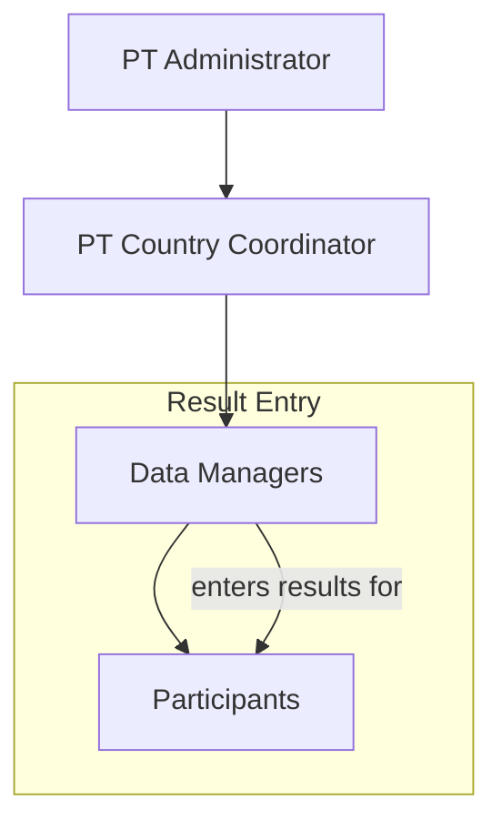
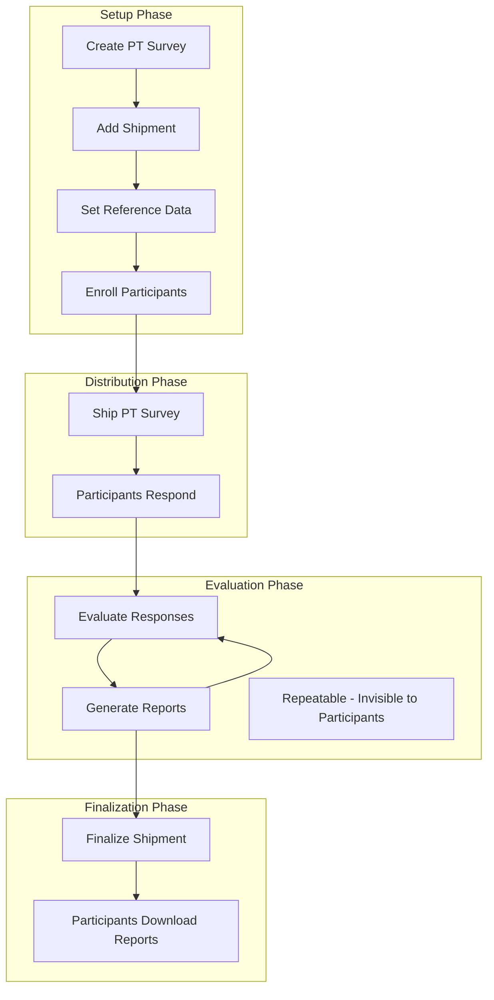
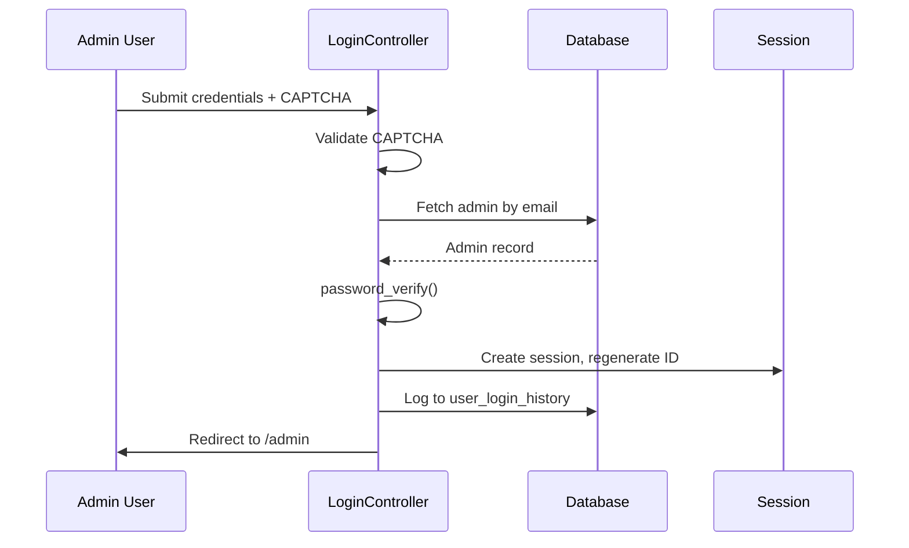
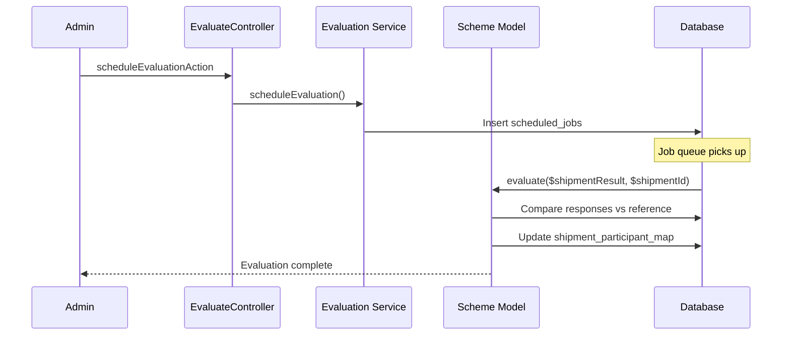

# Admin Module Guide

This document provides a comprehensive guide to the ePT Admin Module, covering workflows, controllers, and technical implementation details.

---

## Table of Contents

1. [Overview](#overview)
2. [User Roles](#user-roles)
3. [Business Workflow](#business-workflow)
4. [Authentication & Authorization](#authentication--authorization)
5. [Module Structure](#module-structure)
6. [Key Controllers](#key-controllers)
7. [AJAX Patterns](#ajax-patterns)
8. [Form Validation](#form-validation)
9. [Common Patterns](#common-patterns)
10. [System Configuration](#system-configuration)
11. [Country-Specific Configurations](#country-specific-configurations)

---

## Overview

The Admin Module (`/admin`) is the PT Provider's interface for managing the entire proficiency testing lifecycle. It handles:

- **PT Survey Management** - Create and manage PT events/distributions
- **Shipment Management** - Add test panels under surveys with reference data
- **Participant Management** - Add, enroll, and track participants
- **Evaluation** - Score participant responses against reference data
- **Report Generation** - Generate Excel and PDF reports
- **System Configuration** - Test kits, assays, email templates, etc.

### Terminology

| Term | Also Known As | Description |
|------|---------------|-------------|
| **PT Survey** | PT Event, PT Distribution | Container for one or more shipments |
| **Shipment** | Panel | A specific test under a survey (one scheme type) |
| **Scheme** | Test Type | DTS, VL, EID, TB, Recency, COVID-19, Custom Tests |
| **Participant** | Laboratory, Site, Tester | Entity that receives and responds to PT shipments |
| **Data Manager** | Lab User | Person who logs in to enter results on behalf of participants |
| **PTCC** | PT Country Coordinator | National/regional user who oversees Data Managers |

---

## User Roles

### Role Hierarchy



### Participants (Testers)

Participants are the entities being tested for proficiency. They can be:

- **Individual persons** - A single tester
- **Testing clinics/laboratories** - An organization performing tests

When a shipment is created, **participants are enrolled** (not Data Managers). Each participant receives samples, performs tests, and their results are evaluated.

### Data Managers

Data Managers are the users who actually log into ePT to:

- **Enter test results** on behalf of participants
- **Download reports** for their assigned participants
- **Track shipment status** and due dates

**Key Rules:**

| Rule | Description |
|------|-------------|
| Minimum mapping | Every participant must have at least one Data Manager assigned |
| Multi-participant | A Data Manager can manage multiple participants |
| Self-management | A participant can be their own Data Manager |

**Use Case - Remote Management:**

In areas with poor internet or computer access, testers may not be able to enter results directly. A Data Manager (perhaps at a regional office) can be assigned to enter results for multiple remote testing sites.

### PT Country Coordinators (PTCC)

PTCC are national or regional-level users who:

- **Do not manage PT** (cannot create surveys, shipments, etc.)
- **Oversee Data Managers** assigned to them
- **Track participation** across their region
- **Support program management** at country level

This role is useful for countries with decentralized PT programs where regional coordinators need visibility into local participation without full administrative access.

### Role Access Summary

| Role | Enter Results | Download Reports | Manage PT | Oversee Users |
|------|---------------|------------------|-----------|---------------|
| PT Administrator | No (admin only) | Yes (all) | Yes | Yes |
| PTCC | No | Yes (assigned) | No | Yes (Data Managers) |
| Data Manager | Yes | Yes (assigned) | No | No |
| Participant | Via Data Manager | Via Data Manager | No | No |

---

## Business Workflow

### Complete PT Lifecycle



### Step-by-Step Workflow

#### 1. Create PT Survey
**Location:** Manage → PT Survey → Add New PT Survey

- Enter PT Survey Code (alphanumeric + hyphens)
- Select PT Survey Date
- Survey acts as a container for multiple shipments

#### 2. Add Shipment(s)
**Location:** PT Survey List → Add Scheme

For each shipment:
- Select scheme type (DTS, VL, EID, TB, etc.)
- Set Shipment Code (auto-generated or custom)
- Set Result Due Date
- Add reference samples with expected results (qualitative tests)
- Configure scheme-specific options (algorithms, test panels, etc.)

#### 3. Enroll Participants
**Location:** Shipment List → Enroll button

- Select participants from available list
- Move to enrolled list
- Participants must be enrolled in the scheme first (Configure → Scheme Enrollments)

#### 4. Ship the PT Survey
**Location:** Manage → PT Survey → Ship Now

- Confirms shipment is ready
- Makes shipment visible to enrolled participants
- Participants can now enter results

#### 5. Participant Response
**Location:** Participant Portal → PT Result Submission

- Participants see shipped shipments
- Enter test results via response form
- Submit before due date

#### 6. Evaluate Responses
**Location:** Analyze → Evaluate Responses → View → Evaluate

- Compares participant responses to reference data
- Calculates scores (response score + documentation score)
- Determines pass/fail
- Can be run multiple times (not visible to participants)

#### 7. Generate Reports
**Location:** Analyze → Generate Reports → View → Report

- Generates participant reports (Excel, PDF)
- Can be regenerated as needed
- Still not visible to participants

#### 8. Finalize Shipment
**Location:** Analyze → Finalize Reports → View → Finalize

- Permanently closes the shipment
- Generates final reports
- **Only now** participants can download their result PDFs
- Cannot be undone

---

## Authentication & Authorization

### Session Management

**Admin Session Namespace:** `administrators`

```php
$adminSession = new Zend_Session_Namespace('administrators');
// Contains: admin_id, primary_email, first_name, last_name, privileges, activeScheme
```

**Session Duration:** 10 hours (`Zend_Session::rememberMe(60 * 60 * 10)`)

### Login Flow



### PT Managers (Admin Users)

PT Managers are the users who access the admin area (`/admin`). Each PT Manager can have:

1. **Scheme Access** - Access to all active schemes or only specific ones (e.g., only DTS and TB)
2. **Privileges** - All privileges or only specific ones

### Privilege System

Privileges are stored as comma-separated values in `system_admin.privileges`:

| Privilege | Access Granted |
|-----------|---------------|
| `config-ept` | Configure ePT - System configuration, PT Managers, global settings |
| `manage-participants` | Manage Participants - Participant management, data managers, enrollments |
| `manage-shipments` | Manage Shipments - Shipments, distributions, shipping |
| `analyze-generate-reports` | Analyze and Generate Reports - Evaluation, reports, finalization |
| `edit-participant-responses` | Edit Participant Responses - Modify submitted participant data |
| `access-reports` | Access Reports - View and download reports |
| `delete-participants` | Delete Participants - Remove participant records |
| `replace-finalized-summary-reports` | Replace Finalized Summary Reports - Override finalized reports |

**Checking Privileges:**
```php
$privileges = explode(',', $adminSession->privileges);
if (!in_array('manage-shipments', $privileges)) {
    $this->redirect('/admin');
}
```

### CSRF Protection

- **Token Generation:** 64-character hex string
- **Storage:** `csrf` session namespace
- **Validation:** Header `X-CSRF-Token` or POST `csrf_token`
- **Exempt:** AJAX requests, API module, GET requests

---

## Module Structure

### Directory Layout

```
application/modules/admin/
├── controllers/           # 41 controller files
│   ├── IndexController.php         # Dashboard
│   ├── LoginController.php         # Authentication
│   ├── ShipmentController.php      # Shipment management
│   ├── DistributionsController.php # PT Survey management
│   ├── ParticipantsController.php  # Participant management
│   ├── EvaluateController.php      # Evaluation & scoring
│   └── ...
│
└── views/scripts/         # View templates by controller
    ├── shipment/
    │   ├── index.phtml
    │   ├── add.phtml
    │   ├── edit.phtml
    │   ├── get-sample-form.ajax.phtml
    │   └── partials/
    │       ├── common/    # Shared form components
    │       └── schemes/   # Scheme-specific forms
    ├── distributions/
    ├── participants/
    ├── evaluate/
    └── ...
```

### Controller Categories

| Category | Controllers | Purpose |
|----------|-------------|---------|
| **Core** | IndexController, LoginController | Dashboard, auth |
| **PT Management** | DistributionsController, ShipmentController | Surveys & shipments |
| **Participants** | ParticipantsController, DataManagersController, EnrollmentsController | User management |
| **Evaluation** | EvaluateController | Scoring & results |
| **Configuration** | GlobalConfigController, TestkitController, various *SettingsController | System setup |
| **Communication** | EmailParticipantsController, AnnouncementController, AlertsController | Notifications |

---

## Key Controllers

### ShipmentController

**Location:** `application/modules/admin/controllers/ShipmentController.php`

**Required Privilege:** `manage-shipments`

#### Key Actions

| Action | Method | Purpose |
|--------|--------|---------|
| `indexAction` | GET/POST | List shipments with filtering |
| `addAction` | GET/POST | Create new shipment under distribution |
| `editAction` | GET/POST | Modify shipment details and samples |
| `getSampleFormAction` | POST (AJAX) | Load scheme-specific sample form |
| `shipItAction` | GET/POST | Ship out to enrolled participants |
| `viewEnrollmentsAction` | GET/POST | View/manage enrolled participants |
| `addEnrollmentsAction` | POST | Enroll participants in shipment |
| `responseSwitchAction` | POST (AJAX) | Toggle response acceptance on/off |

#### Services Used

```php
$shipmentService = new Application_Service_Shipments();
$schemeService = new Application_Service_Schemes();
$participantService = new Application_Service_Participants();
$distributionService = new Application_Service_Distribution();
```

### EvaluateController

**Location:** `application/modules/admin/controllers/EvaluateController.php`

**Required Privilege:** `analyze-generate-reports`

#### Key Actions

| Action | Method | Purpose |
|--------|--------|---------|
| `indexAction` | GET | List distributions for evaluation |
| `getShipmentsAction` | POST (AJAX) | Get shipments under distribution |
| `scheduleEvaluationAction` | POST (AJAX) | Queue evaluation job |
| `shipmentAction` | GET | View shipment for evaluation |
| `editAction` | GET/POST | Evaluate with manual overrides |
| `vlRangeAction` | GET/POST (AJAX) | Configure VL Z-score ranges |
| `excludeParticipantAction` | POST (AJAX) | Exclude participant from scoring |

#### Evaluation Flow



### DistributionsController

**Location:** `application/modules/admin/controllers/DistributionsController.php`

**Required Privilege:** `manage-shipments`

#### Key Actions

| Action | Method | Purpose |
|--------|--------|---------|
| `indexAction` | GET/POST | List PT Surveys |
| `addAction` | GET/POST | Create new PT Survey |
| `editAction` | GET/POST | Modify PT Survey |
| `viewShipmentAction` | GET (AJAX) | Get shipments under survey |
| `shipDistributionAction` | GET | Ship the entire survey |
| `generateSurveyCodeAction` | POST (AJAX) | Auto-generate survey code |

### ParticipantsController

**Location:** `application/modules/admin/controllers/ParticipantsController.php`

**Required Privilege:** `config-ept` OR `manage-participants`

#### Key Actions

| Action | Method | Purpose |
|--------|--------|---------|
| `indexAction` | GET/POST | List participants (DataTables) |
| `addAction` | GET/POST | Add single participant |
| `editAction` | GET/POST | Modify participant |
| `bulkImportAction` | GET/POST | Bulk import from Excel |
| `participantManagerMapAction` | GET/POST | Assign data managers |
| `exportParticipantsDetailsAction` | POST (AJAX) | Export to Excel |

---

## AJAX Patterns

### AjaxContext Registration

Controllers register AJAX actions in `init()`:

```php
public function init()
{
    $ajaxContext = $this->_helper->getHelper('AjaxContext');
    $ajaxContext->addActionContext('get-sample-form', 'html')
        ->addActionContext('get-shipment-code', 'html')
        ->addActionContext('view-enrollments', 'html')
        ->initContext();
}
```

### Common AJAX File Pattern

AJAX views use `.ajax.phtml` suffix and return HTML or JSON:

```
views/scripts/{controller}/
├── index.phtml           # Regular view
├── add.phtml
├── get-data.ajax.phtml   # AJAX response (HTML)
└── search.ajax.phtml
```

### DataTables Server-Side

Used for paginated lists:

```javascript
$('#participantsTable').dataTable({
    "bServerSide": true,
    "sAjaxSource": "/admin/participants/index/format/html",
    "fnServerData": function(sSource, aoData, fnCallback) {
        $.ajax({
            type: "POST",
            url: sSource,
            data: aoData,
            success: fnCallback
        });
    }
});
```

### Select2 AJAX Dropdowns

For searchable dropdowns:

```javascript
$("#labId").select2({
    ajax: {
        url: "/reports/common/get-ajax-drop-downs",
        dataType: 'json',
        data: function(params) {
            return { tableName: 'participant', search: params.term };
        },
        processResults: function(data) {
            return { results: data.result };
        }
    }
});
```

### JSON Response Pattern

For API-style responses:

```php
public function getDataAction()
{
    $this->_helper->layout()->disableLayout();
    $this->_helper->viewRenderer->setNoRender(true);

    $data = $this->service->getData($this->getAllParams());

    $this->getResponse()->setHeader('Content-Type', 'application/json');
    echo json_encode($data);
}
```

---

## Form Validation

### Client-Side: deforayValidator

**Location:** `public/js/deforayValidation.js`

Apply validation via CSS classes:

```html
<input type="email" name="email"
       class="isRequired isEmail form-control"
       title="Please enter a valid email address">
```

**Available Validators:**

| Class | Validation |
|-------|------------|
| `isRequired` | Field cannot be empty |
| `isEmail` | Valid email format |
| `isNumeric` | Numbers only |
| `isAlpha` | Letters only |
| `isAlphaNum` | Alphanumeric only |
| `minLength_N` | Minimum N characters |
| `maxLength_N` | Maximum N characters |
| `confirmPassword` | Matches password field |

**Usage:**

```javascript
function validateNow() {
    var flag = deforayValidator.init({ formId: 'shipmentForm' });
    if (flag && !duplicated) {
        $.blockUI();
        document.getElementById('shipmentForm').submit();
    }
}
```

### Duplicate Checking

Real-time AJAX validation for unique fields:

```html
<input type="text" name="partnerName"
       onblur="checkDuplicate('partners', 'partner_name', 'partnerName', null, 'Name already exists')">
```

For edit forms (exclude current record):

```html
<input type="text" name="partnerName"
       onblur="checkDuplicate('partners', 'partner_name', 'partnerName',
               'partner_id##<?php echo $this->partner['partner_id']; ?>', 'Name already exists')">
```

### Server-Side Validation

**Common Service** (`application/services/Common.php`):

```php
// Email validation
$validEmail = $commonService->validateEmail($email);

// Password validation
$result = $commonService->validatePassword($password, $name, $email);

// Required fields
$valid = $commonService->validateRequiredFields($formData, ['field1', 'field2']);
```

---

## Common Patterns

### Base64 Parameter Encoding

Sensitive IDs are base64 encoded in URLs:

```php
// Encoding (in view)
$encodedId = base64_encode($shipment['shipment_id']);
<a href="/admin/shipment/edit/sid/<?php echo $encodedId; ?>">Edit</a>

// Decoding (in controller)
$shipmentId = (int) base64_decode($this->_getParam('sid'));
```

### Layout Management

```php
// Set page identifier for menu highlighting
$this->view->pageName = 'manageMenu';

// Disable layout for AJAX
$this->_helper->layout()->disableLayout();

// Use modal layout
$this->_helper->layout->setLayout('modal');
```

### Service Layer Pattern

Controllers delegate to services:

```php
// Controller (thin)
public function addAction()
{
    if ($this->getRequest()->isPost()) {
        $this->shipmentService->addShipment($this->getRequest()->getPost());
        $this->redirect('/admin/shipment');
    }
}

// Service (business logic)
public function addShipment($params)
{
    // Validation, transformation, DB operations
    $shipmentDb = new Application_Model_DbTable_Shipments();
    return $shipmentDb->addShipment($params);
}
```

### Redirect After POST

Standard pattern to prevent duplicate submissions:

```php
if ($request->isPost()) {
    $service->processData($request->getPost());
    $this->redirect('/admin/controller');  // Always redirect
}
```

---

## System Configuration

### Global Config - Scheme Activation

Not all deployments use all test schemes. In **Global Config**, administrators can enable/disable which schemes are active for the current instance:

- Some deployments use only DTS (HIV Serology)
- Some use only TB
- Some use multiple schemes (DTS, VL, EID)
- Custom Tests can be configured for organization-specific needs

When a PT Manager is created, they can be granted access to all active schemes or only specific ones.

### Test Kits

Test kits are a critical component of ePT:

- **Pre-loaded kits** - System includes standard test kits commonly used in PT programs
- **Custom kits** - Users can add their own test kits specific to their region/program
- **Kit assignment** - Admins configure which test kits are available for each scheme

**Location:** Configure → Test Kits

### Scheme-Specific Settings

Non-custom schemes have dedicated configuration pages:

| Scheme | Settings Page | Key Configurations |
|--------|---------------|-------------------|
| DTS | DTS Settings | Algorithm type, test panel count, result options |
| VL | VL Settings | Assay list, Z-score thresholds, reference methods |
| EID | EID Settings | Result interpretation rules |
| TB | TB Settings | Molecular vs microscopy options, drug resistance |
| Recency | Recency Settings | RTRI cutoffs, viral load thresholds |
| COVID-19 | COVID-19 Settings | Platform options, Ct value ranges |

**Location:** Configure → {Scheme} Settings

### Multi-Test Algorithms (HIV Serology)

For HIV Serology testing (DTS), participants often run multiple tests before drawing a conclusion:

```text
Test-1 (Screening) → Test-2 (Confirmatory) → Test-3 (Tiebreaker) → Final Interpretation
```

Administrators configure:

1. **Which test kits** are available for each test position (Test-1, Test-2, Test-3)
2. **Algorithm rules** for how results combine to produce the final interpretation
3. **Expected results** for each reference sample

This allows flexibility for different national algorithms (WHO 3-test, Malawi algorithm, etc.).

---

## Country-Specific Configurations

ePT is deployed globally with country-specific adaptations:

### Testing Algorithms

| Country | Algorithm |
|---------|-----------|
| WHO Standard | 3-test algorithm |
| Malawi | Custom algorithm with PT Email/Phone fields |
| Myanmar | Custom algorithm |
| Zimbabwe | Custom algorithm |

The `reportType` configuration determines which fields appear:

```php
if ($this->reportType == 'malawi') {
    // Show PT Email and PT Phone fields
}
```

### Scheme Origins

| Scheme | Description | Notes |
|--------|-------------|-------|
| **DTS** | HIV Serology (Dried Tube Specimen) | Original scheme, core functionality |
| **VL** | HIV Viral Load | Quantitative testing with Z-score analysis |
| **EID** | Early Infant Diagnosis | PCR-based infant HIV testing |
| **TB** | Tuberculosis | Molecular (GeneXpert) + Microscopy |
| **Recency** | HIV Recency | RTRI-based recent infection testing |
| **COVID-19** | COVID-19 Testing | Added during pandemic, multi-platform PCR |
| **DBS** | Dried Blood Spot | EIA and Western Blot testing |
| **Custom Tests** | User-configurable | Added by popular request for organization-specific tests |

---

## Related Documentation

- [Architecture Guide](ARCHITECTURE.md) - System-wide architecture
- [Scheme Architecture](SchemeArchitecture.md) - Test scheme implementation details
- [Documentation Index](README.md) - All documentation
