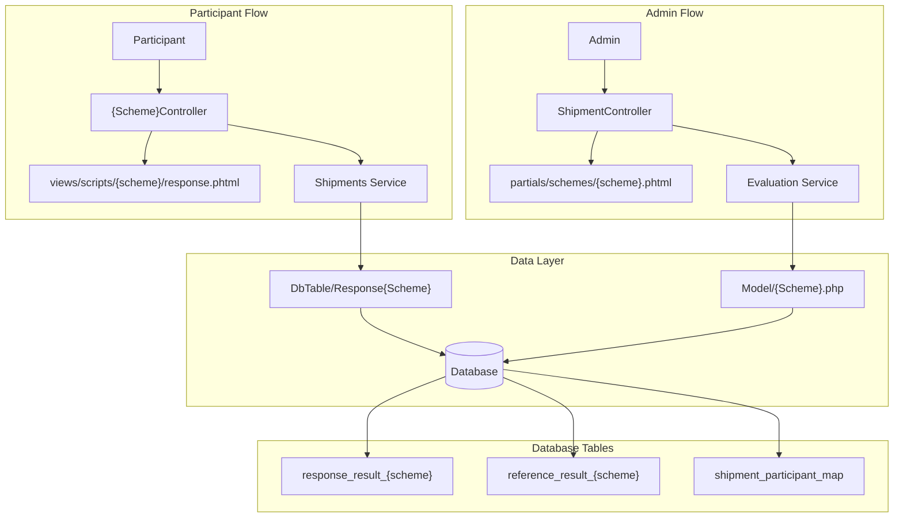
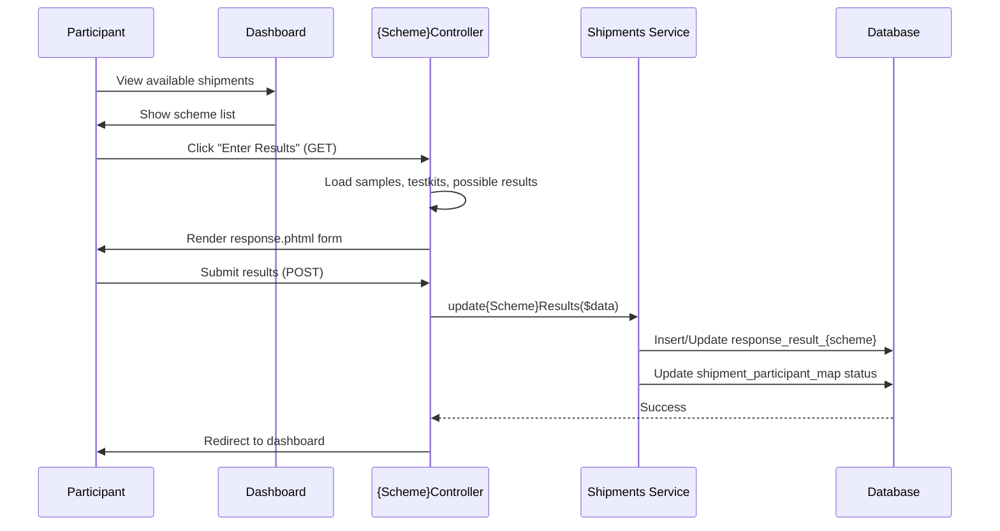
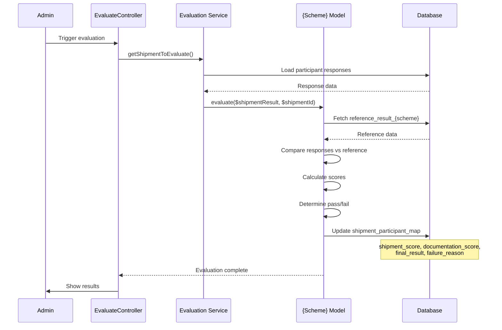
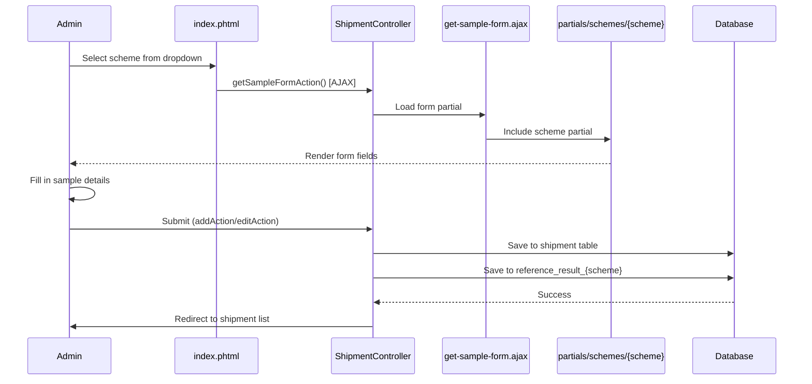
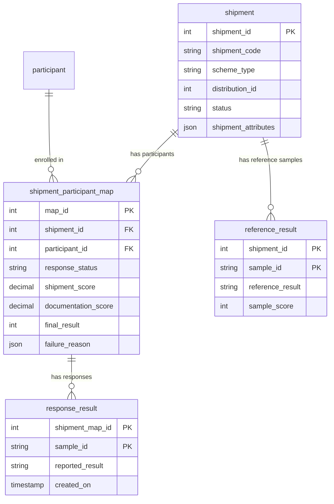
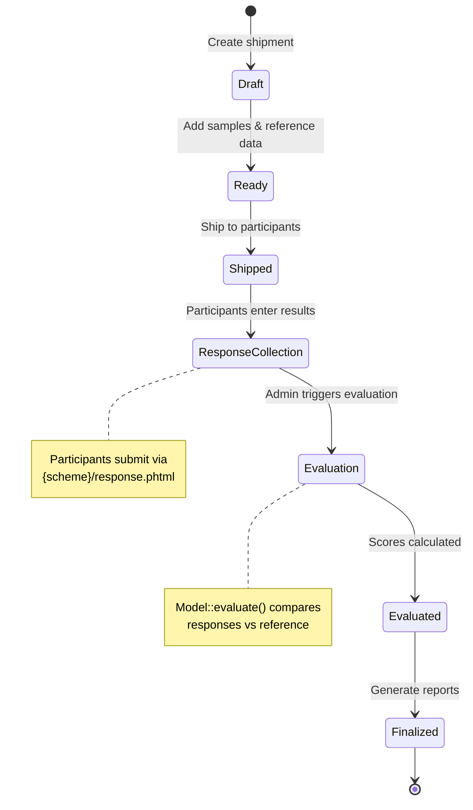
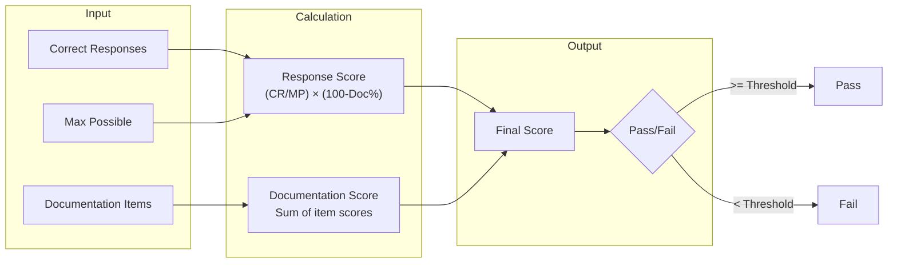
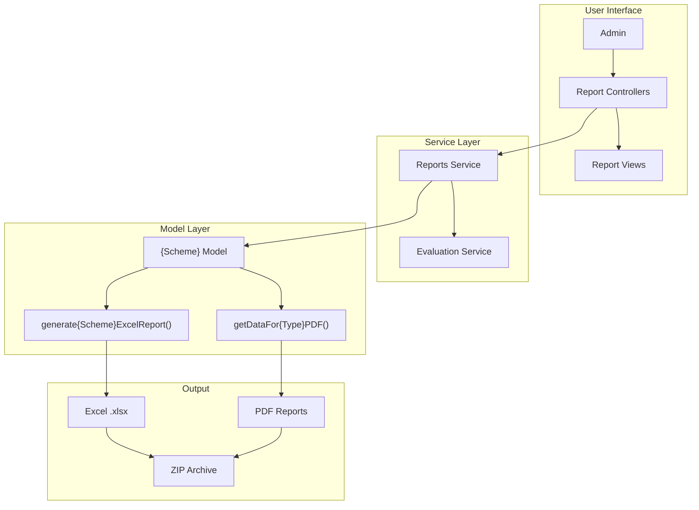
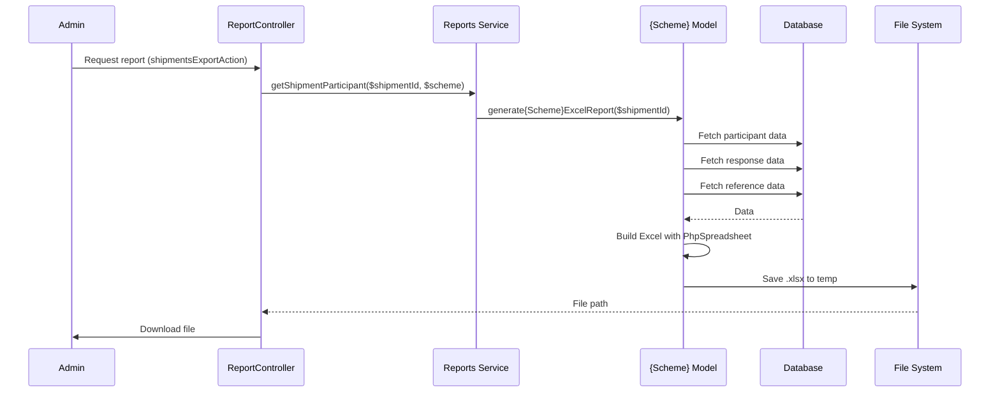

# Scheme Architecture Guide

This document explains how test schemes (DTS, VL, EID, TB, Recency, COVID-19, DBS, Custom Tests) are organized in the EPT project. Use this as a reference when maintaining existing schemes or adding new ones.

---

## Table of Contents

1. [Overview](#overview)
2. [Directory Structure](#directory-structure)
3. [Scheme Components](#scheme-components)
4. [Data Flow](#data-flow)
5. [Adding a New Scheme](#adding-a-new-scheme)
6. [Scheme-Specific Details](#scheme-specific-details)

---

## Overview

Each scheme in EPT follows a consistent MVC architecture:



| Component | Purpose | Location |
|-----------|---------|----------|
| **Model** | Evaluation logic, scoring, reports | `application/models/{Scheme}.php` |
| **Controller** | Request handling, response entry | `application/controllers/{Scheme}Controller.php` |
| **Views** | Participant response forms | `application/views/scripts/{scheme}/` |
| **DbTable** | Database persistence | `application/models/DbTable/Response{Scheme}.php` |
| **Admin Partial** | Shipment add/edit forms | `application/modules/admin/views/scripts/shipment/partials/schemes/{scheme}.phtml` |

---

## Directory Structure

```
application/
├── models/
│   ├── Dts.php                    # DTS evaluation & reports
│   ├── Vl.php                     # VL evaluation & reports
│   ├── Tb.php                     # TB evaluation & reports
│   ├── Eid.php                    # EID evaluation & reports
│   ├── Recency.php                # Recency evaluation & reports
│   ├── Covid19.php                # COVID-19 evaluation & reports
│   ├── CustomTest.php             # Custom Tests evaluation
│   └── DbTable/
│       ├── ResponseDts.php        # response_result_dts table
│       ├── ResponseVl.php         # response_result_vl table
│       ├── ResponseTb.php         # response_result_tb table
│       ├── ResponseEid.php        # response_result_eid table
│       ├── ResponseRecency.php    # response_result_recency table
│       ├── ResponseCovid19.php    # response_result_covid19 table
│       ├── ResponseDbs.php        # response_result_dbs table
│       ├── ResponseGenericTest.php # response_result_generic_test table (Custom Tests)
│       ├── Shipments.php          # shipment table
│       └── ShipmentParticipantMap.php # shipment_participant_map table
│
├── controllers/
│   ├── DtsController.php          # DTS response entry
│   ├── VlController.php           # VL response entry
│   ├── TbController.php           # TB response entry
│   ├── EidController.php          # EID response entry
│   ├── RecencyController.php      # Recency response entry
│   ├── Covid19Controller.php      # COVID-19 response entry
│   ├── DbsController.php          # DBS response entry
│   └── CustomTestController.php   # Custom Tests response entry
│
├── views/scripts/
│   ├── dts/response.phtml         # DTS response form
│   ├── vl/response.phtml          # VL response form
│   ├── tb/response.phtml          # TB response form
│   ├── eid/response.phtml         # EID response form
│   ├── recency/response.phtml     # Recency response form
│   ├── covid19/response.phtml     # COVID-19 response form
│   ├── dbs/response.phtml         # DBS response form
│   └── custom-test/response.phtml # Custom Tests response form
│
├── services/
│   ├── Shipments.php              # updateDtsResults(), updateVlResults(), etc.
│   ├── Schemes.php                # getPossibleResults(), getSchemeControls(), etc.
│   ├── Evaluation.php             # Evaluation workflow management
│   └── Reports.php                # Report generation
│
└── modules/admin/views/scripts/shipment/
    ├── edit.phtml                 # Slim wrapper (includes partials)
    ├── get-sample-form.ajax.phtml # AJAX loader for ADD flow
    └── partials/
        ├── common/
        │   ├── form-header.phtml  # Shared header fields
        │   ├── form-footer.phtml  # Submit buttons
        │   └── form-scripts.phtml # Shared JavaScript
        └── schemes/
            ├── dts.phtml          # DTS shipment form
            ├── vl.phtml           # VL shipment form
            ├── tb.phtml           # TB shipment form
            ├── eid.phtml          # EID shipment form
            ├── recency.phtml      # Recency shipment form
            ├── covid19.phtml      # COVID-19 shipment form
            ├── dbs.phtml          # DBS shipment form
            └── generic.phtml      # Custom Tests shipment form
```

---

## Scheme Components

### 1. Model (`application/models/{Scheme}.php`)

Each scheme model contains the `evaluate()` method - the core evaluation logic:

```php
public function evaluate($shipmentResult, $shipmentId, $reEvaluate = false)
{
    // 1. Fetch reference results
    // 2. Compare participant responses vs reference
    // 3. Calculate scores (response + documentation)
    // 4. Determine pass/fail
    // 5. Update shipment_participant_map with results
    // 6. Return evaluation summary
}
```

**Key Methods in Models:**

| Method | Purpose |
|--------|---------|
| `evaluate()` | Core scoring logic |
| `generate{Scheme}ExcelReport()` | Excel report generation |
| `getDataForIndividualPDFBatch()` | PDF report data |
| `get{Scheme}Samples()` | Retrieve sample data |

**Model Sizes (complexity indicator):**
- TB.php: 133K (most complex - molecular/microscopy)
- VL.php: 114K (Z-score calculations)
- DTS.php: 111K (multiple algorithms)
- Covid19.php: 79K
- CustomTest.php: 79K
- Recency.php: 63K
- Eid.php: 21K (simplest)

### 2. Controller (`application/controllers/{Scheme}Controller.php`)

Handles participant response entry:

```php
public function responseAction()
{
    if ($this->getRequest()->isPost()) {
        // Save results via service layer
        $this->shipmentService->update{Scheme}Results($data);
        // Redirect appropriately
    } else {
        // Load form data
        $this->view->samples = $this->schemeService->get{Scheme}Samples();
        $this->view->possibleResults = $this->schemeService->getPossibleResults();
        // Render response.phtml
    }
}
```

**Common Controller Actions:**
- `responseAction()` - Main response entry (GET: show form, POST: save)
- `downloadAction()` - Download reference data/reports
- `deleteAction()` - Delete response (if applicable)

### 3. Response View (`application/views/scripts/{scheme}/response.phtml`)

Participant-facing form for entering test results. Common elements:

- Laboratory/Participant information
- Receipt and testing dates
- Assay/kit selection
- Results table (scheme-specific columns)
- QC section (conditional)
- Supervisor review
- File upload (some schemes)
- Manual override (admin only)

### 4. DbTable (`application/models/DbTable/Response{Scheme}.php`)

Database persistence layer:

```php
class Application_Model_DbTable_ResponseDts extends Zend_Db_Table_Abstract
{
    protected $_name = 'response_result_dts';
    protected $_primary = array('shipment_map_id', 'sample_id');

    public function updateResults($params)
    {
        // Insert or update response records
    }

    public function updateResultsByAPI($params, $dm)
    {
        // API-based result submission
    }
}
```

### 5. Admin Partial (`partials/schemes/{scheme}.phtml`)

Unified shipment add/edit form that works for both flows:

```php
<?php
// Mode detection
$isEditMode = isset($this->shipmentData) && !empty($this->shipmentData);

// Normalize data
$samples = $isEditMode
    ? $this->shipmentData['reference']
    : $this->schemeControls;

$possibleResults = $isEditMode
    ? $this->shipmentData['possibleResults']
    : $this->schemePossibleResults;
?>
<!-- Form HTML works for both ADD and EDIT -->
```

---

## Data Flow

### Participant Response Flow



### Evaluation Flow



### Shipment Creation Flow (Admin)



---

## Database Tables

### Core Tables

| Table | Purpose |
|-------|---------|
| `shipment` | Shipment metadata, status, configuration |
| `shipment_participant_map` | Links shipments to participants, stores scores |
| `scheme_list` | Scheme definitions and configuration |

### Per-Scheme Tables

| Scheme | Response Table | Reference Table |
|--------|---------------|-----------------|
| DTS | `response_result_dts` | `reference_result_dts` |
| VL | `response_result_vl` | `reference_result_vl` |
| TB | `response_result_tb` | `reference_result_tb` |
| EID | `response_result_eid` | `reference_result_eid` |
| Recency | `response_result_recency` | `reference_result_recency` |
| COVID-19 | `response_result_covid19` | `reference_result_covid19` |
| DBS | `response_result_dbs` | `reference_result_dbs` |
| Custom Tests | `response_result_generic_test` | (uses scheme config) |

### Table Relationships



---

## Adding a New Scheme

### Step 1: Create Model

Create `application/models/NewScheme.php`:

```php
class Application_Model_NewScheme
{
    public function evaluate($shipmentResult, $shipmentId, $reEvaluate = false)
    {
        // Implement evaluation logic
    }

    public function generateNewSchemeExcelReport($shipmentId)
    {
        // Implement report generation
    }
}
```

### Step 2: Create DbTable

Create `application/models/DbTable/ResponseNewScheme.php`:

```php
class Application_Model_DbTable_ResponseNewScheme extends Zend_Db_Table_Abstract
{
    protected $_name = 'response_result_newscheme';
    protected $_primary = array('shipment_map_id', 'sample_id');

    public function updateResults($params) { /* ... */ }
}
```

### Step 3: Create Controller

Create `application/controllers/NewschemeController.php`:

```php
class NewschemeController extends Zend_Controller_Action
{
    public function responseAction()
    {
        // Handle GET and POST
    }
}
```

### Step 4: Create Response View

Create `application/views/scripts/newscheme/response.phtml`

### Step 5: Create Admin Partial

Create `application/modules/admin/views/scripts/shipment/partials/schemes/newscheme.phtml`

### Step 6: Update Routers

Add to `get-sample-form.ajax.phtml`:
```php
} elseif ($this->scheme == 'newscheme') {
    include('partials/schemes/newscheme.phtml');
}
```

Add to `edit.phtml`:
```php
} elseif ($shipmentData['shipment']['scheme_type'] == 'newscheme') {
    include dirname(__FILE__) . '/partials/schemes/newscheme.phtml';
}
```

### Step 7: Update Service Layer

Add to `Shipments.php`:
```php
public function updateNewSchemeResults($data)
{
    // Implement result saving logic
}
```

### Step 8: Create Database Tables

```sql
CREATE TABLE reference_result_newscheme (
    shipment_id INT,
    sample_id VARCHAR(255),
    -- scheme-specific fields
    PRIMARY KEY (shipment_id, sample_id)
);

CREATE TABLE response_result_newscheme (
    shipment_map_id INT,
    sample_id VARCHAR(255),
    -- scheme-specific fields
    PRIMARY KEY (shipment_map_id, sample_id)
);
```

---

## Scheme-Specific Details

### DTS (Dried Tube Specimen)

- **Complexity**: High (multiple algorithms, RTRI support, syphilis testing)
- **Key Features**:
  - 2 or 3 test panel configuration
  - Multiple testing algorithms (Serial, Parallel, etc.)
  - EIA/WB/Geenius modals for detailed results
  - Optional syphilis and RTRI testing
  - Algorithm-based scoring

### VL (Viral Load)

- **Complexity**: High (quantitative analysis)
- **Key Features**:
  - Z-score based evaluation
  - Assay-specific range calculations
  - TND (Target Not Detected) handling
  - Log10 conversion support
  - File upload for raw data

### TB (Tuberculosis)

- **Complexity**: High (multiple assay types)
- **Key Features**:
  - Molecular vs Microscopy test types
  - GeneXpert MTB/RIF and Ultra support
  - Rif resistance detection
  - Probe values (A, B, C, D, E)
  - Instrument tracking
  - Draft save capability

### EID (Early Infant Diagnosis)

- **Complexity**: Low (simplest scheme)
- **Key Features**:
  - Binary result matching
  - CT/OD value capture
  - Extraction assay selection

### Recency

- **Complexity**: Medium
- **Key Features**:
  - RTRI algorithm support
  - Control/Verification/Longterm line interpretation
  - Recency classification (Negative/Recent/Long-term)

### COVID-19

- **Complexity**: Medium
- **Key Features**:
  - 1-3 test platform support
  - PCR reagent tracking
  - Gene type identification
  - Platform validation

### DBS (Dried Blood Spot)

- **Complexity**: Medium-High
- **Key Features**:
  - Multiple EIA tests (up to 3)
  - Western Blot with 9 protein bands
  - OD and cutoff values

### Custom Tests

- **Complexity**: Configurable
- **Key Features**:
  - Supports qualitative and quantitative tests
  - Configurable pass/fail thresholds
  - Dynamic field configuration
  - Custom test kit management

---

## Configuration

Scheme configuration is managed via `Pt_Commons_SchemeConfig::get('{scheme}')`:

```php
$config = Pt_Commons_SchemeConfig::get('dts');
// Returns: allowedAlgorithms, dtsSchemeType, rtriEnabled, etc.
```

Configuration sources:
1. Database: `scheme_list.user_test_config` (JSON)
2. System config files
3. Model defaults

---

## Shipment Lifecycle



## Scoring Formula

Most schemes follow this pattern:



**Formula:**

```text
Response Score = (Correct Responses / Max Possible) × (100 - Documentation%)
Documentation Score = Sum of documentation item scores
Final Score = Response Score + Documentation Score
Pass = Final Score >= Passing Percentage (configurable per scheme)
```

---

## Report Generation & Excel Export

### Report Architecture



### Excel Report Methods by Scheme

Each scheme model has a dedicated Excel report generation method:

| Scheme | Model Method | Output |
|--------|-------------|--------|
| DTS | `generateDtsRapidHivExcelReport($shipmentId)` | Multi-sheet XLSX with test results, scores |
| VL | `generateDtsViralLoadExcelReport($shipmentId)` | Participant details, assay results, Z-scores |
| TB | `generateTbExcelReport($shipmentId)` | Participant list, MTB/RIF results |
| EID | `generateDbsEidExcelReport($shipmentId)` | EID PT results, assay info |
| Recency | `generateRecencyExcelReport($shipmentId)` | Lab info, recency PT results |
| COVID-19 | `generateCovid19ExcelReport($shipmentId)` | Instructions, test types, responses |
| Custom Tests | `generateGenericTestExcelReport($shipmentId, $schemeType)` | Participant list, test responses |

### PDF Generation Methods

Some schemes support individual and summary PDF reports:

| Scheme | Individual PDF | Summary PDF |
|--------|---------------|-------------|
| TB | `getDataForIndividualPDFBatch($mapIds)` | `getDataForSummaryPDF($shipmentId)` |
| VL | `getDataForIndividualPDFBatch($shipmentId, $mapIds, $attributes)` | - |
| Custom Tests | - | `getDataForSummaryPDF($shipmentId)` |

### Report Controllers

Located in `application/modules/reports/controllers/`:

| Controller | Key Actions | Purpose |
|------------|-------------|---------|
| `ShipmentsController` | `indexAction`, `shipmentsExportAction` | Shipment overview reports |
| `ShipmentResponseController` | `indexAction`, `shipmentsExportPdfAction` | Response reports |
| `FinalizeController` | `shipmentsAction`, `sendReportMailAction` | Finalized reports |
| `ParticipantPerformanceController` | `indexAction`, `exportAction` | Performance analytics |
| `ParticipantTrendsController` | `indexAction` | Trend analysis |
| `CorrectiveActionsController` | `indexAction` | Corrective action reports |
| `TbResultsController` | `indexAction` | TB-specific results |
| `TbAllSitesResultsController` | `indexAction` | Multi-site TB reports |

### Report Service (`application/services/Reports.php`)

Central orchestration for report generation:

```php
// Route to scheme-specific Excel generation
public function getShipmentParticipant($shipmentId, $schemeType = null)
{
    switch ($schemeType) {
        case 'dts': return $this->dtsModel->generateDtsRapidHivExcelReport($shipmentId);
        case 'vl': return $this->vlModel->generateDtsViralLoadExcelReport($shipmentId);
        case 'tb': return $this->tbModel->generateTbExcelReport($shipmentId);
        // ... etc
    }
}

// Generate overview report
public function exportShipmentsReport($params)
{
    // Creates "Shipment Response Overview" Excel
    // Columns: scheme, shipment code, sample label, responses, pass rates
}
```

### Report Flow



### File Output Locations

| Type | Path | Example |
|------|------|---------|
| Temp exports | `TEMP_UPLOAD_PATH/` | `shipment-response-1706284800.xlsx` |
| Summary PDFs | `/downloads/reports/{code}/` | `DTS-2024-01-summary.pdf` |
| Individual PDFs | `/downloads/reports/{code}/` | `DTS-2024-01-{participant}.pdf` |
| ZIP archives | `/downloads/reports/` | `DTS-2024-01.zip` |
| TB Forms | `TEMP_UPLOAD_PATH/` | `DTS-2024-01-TB-FORMS.zip` |

### Excel Report Structure (Example: DTS)

```
DTS-Shipment-Report.xlsx
├── Sheet 1: Instructions
│   └── Tab descriptions, color coding legend
├── Sheet 2: Participant List
│   └── Lab ID, Name, Country, Region, Site Type
├── Sheet 3: PT Results
│   └── Sample, Test 1/2/3 Results, Final Result, Score
├── Sheet 4: Panel Score
│   └── Per-sample scoring breakdown
├── Sheet 5: Documentation Score
│   └── Receipt date, rehydration, testing date scores
└── Sheet 6: Total Score
    └── Response + Documentation = Final Score, Pass/Fail
```

### Supported Export Formats

| Format | Library | Use Case |
|--------|---------|----------|
| Excel (.xlsx) | PhpOffice\PhpSpreadsheet | Detailed data export, analysis |
| PDF | TCPDF/Custom | Individual certificates, summaries |
| ZIP | ZipArchive | Bulk downloads, all reports bundled |

### Adding Reports for New Scheme

1. **Add Excel method to Model**:
```php
public function generateNewSchemeExcelReport($shipmentId)
{
    $excel = new Spreadsheet();
    // Build sheets...
    $writer = IOFactory::createWriter($excel, 'Xlsx');
    $filename = 'newscheme-' . $shipmentId . '.xlsx';
    $writer->save(TEMP_UPLOAD_PATH . '/' . $filename);
    return $filename;
}
```

2. **Add to Reports Service**:
```php
case 'newscheme':
    return $this->newSchemeModel->generateNewSchemeExcelReport($shipmentId);
```

3. **Add PDF support (optional)**:
```php
public function getDataForIndividualPDFBatch($mapIds)
{
    // Fetch data for PDF generation
}
```

---

## Related Documentation

- [Admin Shipment Forms](https://github.com/deforay/ept/blob/master/application/modules/admin/views/scripts/shipment/partials/README.md)
- Database migrations in `/database/migrations/`
- API documentation for external integrations
