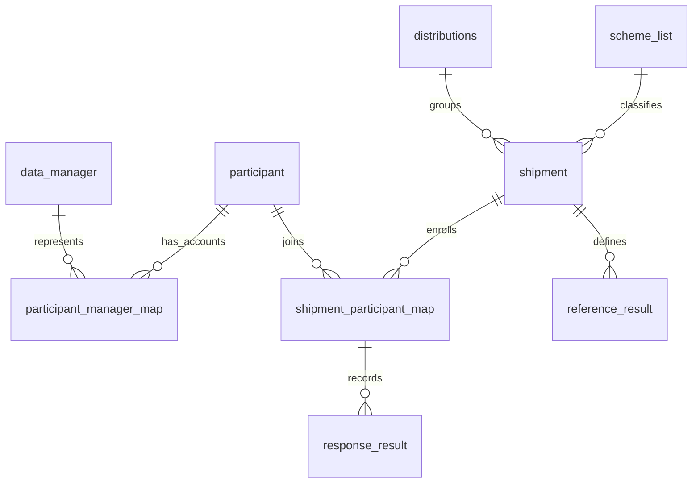

# Data model and core dictionary

[Français](fr/data-model.md)

This reference describes core ePT 7.6.21 entities and selected business fields.
It is not a complete physical schema or a field dictionary for every scheme.
The [physical column reference](physical-schema.md) records all 1,156 columns from a
reference database at this version, including types, defaults and nullability.

## Logical relationships

`reference_result` and `response_result` represent scheme-specific table families in
this diagram. They are not literal table names. Relationships describe application
joins, not a guarantee that every relationship has a database foreign-key constraint.

## Entity dictionary

| Entity or table | Meaning | Principal relationship |
| --- | --- | --- |
| `participant` | Laboratory, testing site or individual tester | Linked to login accounts and shipment enrollments |
| `data_manager` | Participant-facing login account | Linked through `participant_manager_map` |
| `participant_manager_map` | Account-to-participant assignment | Joins `dm_id` and `participant_id` |
| `distributions` | PT survey grouping | Parent of shipments through `distribution_id` |
| `scheme_list` | Built-in and configured test schemes | Classifies shipments |
| `shipment` | PT round for a scheme | Owns reference samples and enrollments |
| `shipment_participant_map` | One participant's enrollment, response metadata and evaluation | Connects participant, shipment and per-sample responses |
| `reference_result_*` | Expected sample results | Belongs to a shipment |
| `response_result_*` | Reported sample results and calculated values | Belongs to a shipment-participant map |
| `global_config` | Programme and report settings | Includes instance-specific configuration |
| `system_config` | System settings and version metadata | Includes the applied application version |
| `scheduled_jobs` | Background job queue | Tracks queued processing |
| `temp_mail` | Outbound email queue | Tracks message processing |
| `audit_log` | Recorded application activity | Holds actor and event information |
| `user_login_history` | Login activity | Supports account and session review |

## Core field dictionary

Types below describe SQL storage in the seed or migrations. Nullability and defaults
for a deployed database require a schema export from that database.

| Field | Type or format | Meaning | Interpretation |
| --- | --- | --- | --- |
| `participant.participant_id` | Integer | Internal participant identifier | Distinct from the programme's visible identifier |
| `participant.unique_identifier` | Text | Programme participant identifier | Used for identifying participants in workflows |
| `data_manager.dm_id` | Integer | Internal login-account identifier | Does not identify a laboratory by itself |
| `shipment.shipment_id` | Integer | Internal shipment identifier | Joins enrollment and reference records |
| `shipment.shipment_code` | Text | Visible PT round code | Used in reports and searches |
| `shipment.scheme_type` | Text | Scheme identifier | Built-in code or configured scheme identifier |
| `shipment.distribution_id` | Integer | Parent survey identifier | Joins `distributions` |
| `shipment.response_deadline` | Datetime | Response cutoff | Interpretation includes configured cutoff timezone |
| `shipment.response_switch` | Text | Response collection switch | `on` or `off` |
| `shipment.shipment_attributes` | JSON | Scheme-specific shipment configuration | Keys differ by scheme |
| `shipment_participant_map.map_id` | Integer | Enrollment identifier | Parent for per-sample responses |
| `shipment_participant_map.response_status` | Text | Response collection state | Includes `responded`, `nottested` and `late_submitted` |
| `shipment_participant_map.final_result` | Integer | Evaluation outcome | 1 Pass, 2 Fail, 3 Excluded, 4 NotEvaluated |
| `shipment_participant_map.shipment_score` | Decimal | Calculated shipment score | Interpretation depends on the scheme |
| `shipment_participant_map.documentation_score` | Decimal | Documentation component | Separate from sample-result scoring |
| `shipment_participant_map.is_excluded` | `yes` / `no`, nullable | Exclusion flag | Requires interpretation with the evaluation outcome |
| `shipment_participant_map.attributes` | JSON | Response-level supporting fields | Keys differ by scheme |
| `shipment_participant_map.started_at` | Datetime, nullable | Recorded start of supported submission flow | Added in migration 7.6.21 |
| `shipment_participant_map.late_submit_status` | Tiny integer, default 0 | Late-submission history flag | Can remain 1 after approval |

Legacy or unevaluated rows can contain other initial values, including a seed default
of 0 for `final_result`. That is not an additional evaluated outcome.
Response status and evaluation outcome answer different questions and are not interchangeable.

## Physical schema sources

| Source | Scope | Limitation |
| --- | --- | --- |
| `sql/init.sql` | Installation seed schema and seed data | Not a standalone representation of every later migration |
| `database/migrations/*.sql` | Versioned schema and data changes | Must be interpreted in migration order |
| `application/models/DbTable/` | Table mappings and application queries | Does not define every physical database constraint |
| Schema-only export | Actual deployed table definitions | Requires capture from the target installation |

The [deployment handover guide](deployment-handover.md) describes schema capture.
A complete dictionary additionally needs field-level meanings, code lists, units,
JSON keys and scheme-specific validation rules reviewed by programme staff.
