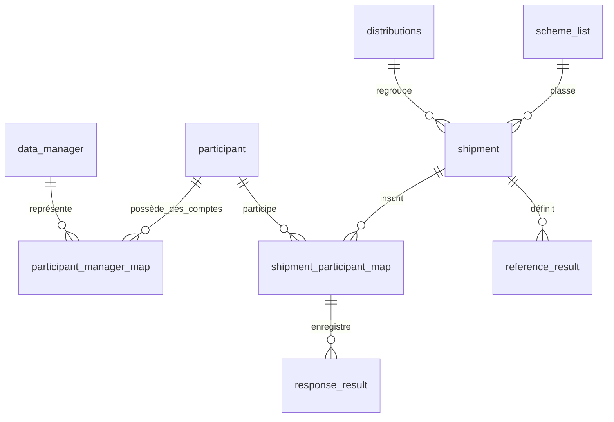

# Modèle de données et dictionnaire principal

[English](../data-model.md)

Ce référentiel décrit les entités principales d'ePT 7.6.21 et une sélection de champs métier.
Il ne constitue ni un schéma physique complet ni un dictionnaire de tous les champs de chaque programme.
Le [référentiel des colonnes physiques](physical-schema.md) décrit les 1 156 colonnes d'une base de référence à cette version.
Il inclut leurs types, valeurs par défaut et règles de nullabilité.

## Relations logiques

Dans ce diagramme, `reference_result` et `response_result` représentent des familles de tables propres aux programmes.
Ce ne sont pas des noms de tables réelles. Les relations décrivent les jointures applicatives.
Elles ne garantissent pas l'existence d'une contrainte de clé étrangère pour chaque relation.

## Dictionnaire des entités

| Entité ou table | Signification | Relation principale |
| --- | --- | --- |
| `participant` | Laboratoire, site de dépistage ou opérateur individuel | Associé aux comptes de connexion et aux inscriptions aux expéditions |
| `data_manager` | Compte de connexion au portail participant | Associé par `participant_manager_map` |
| `participant_manager_map` | Attribution d'un participant à un compte | Joint `dm_id` et `participant_id` |
| `distributions` | Regroupement d'une enquête PT | Parent des expéditions par `distribution_id` |
| `scheme_list` | Programmes de tests intégrés et configurés | Classe les expéditions |
| `shipment` | Cycle PT d'un programme | Contient les échantillons de référence et les inscriptions |
| `shipment_participant_map` | Inscription, métadonnées de réponse et évaluation d'un participant | Relie le participant, l'expédition et les réponses par échantillon |
| `reference_result_*` | Résultats attendus des échantillons | Appartient à une expédition |
| `response_result_*` | Résultats déclarés et valeurs calculées | Appartient à une association expédition-participant |
| `global_config` | Paramètres du programme et des rapports | Inclut la configuration propre à l'instance |
| `system_config` | Paramètres système et métadonnées de version | Inclut la version applicative appliquée |
| `scheduled_jobs` | File des tâches en arrière-plan | Suit les traitements en file |
| `temp_mail` | File des courriels sortants | Suit le traitement des messages |
| `audit_log` | Activité applicative enregistrée | Contient les informations sur les acteurs et les événements |
| `user_login_history` | Activité de connexion | Sert à examiner les comptes et les sessions |

## Dictionnaire des champs principaux

Les types ci-dessous décrivent le stockage SQL du schéma initial ou des migrations.
La nullabilité et les valeurs par défaut d'une installation nécessitent un export de son propre schéma.

| Champ | Type ou format | Signification | Interprétation |
| --- | --- | --- | --- |
| `participant.participant_id` | Entier | Identifiant interne du participant | Distinct de l'identifiant visible du programme |
| `participant.unique_identifier` | Texte | Identifiant du participant dans le programme | Utilisé pour identifier les participants dans les processus |
| `data_manager.dm_id` | Entier | Identifiant interne du compte | N'identifie pas à lui seul un laboratoire |
| `shipment.shipment_id` | Entier | Identifiant interne de l'expédition | Relie les inscriptions et les références |
| `shipment.shipment_code` | Texte | Code visible du cycle PT | Utilisé dans les rapports et les recherches |
| `shipment.scheme_type` | Texte | Identifiant du programme | Code intégré ou identifiant d'un programme configuré |
| `shipment.distribution_id` | Entier | Identifiant de l'enquête parente | Joint `distributions` |
| `shipment.response_deadline` | Date et heure | Échéance de réponse | Son interprétation inclut le fuseau horaire configuré |
| `shipment.response_switch` | Texte | Commutateur de collecte des réponses | `on` ou `off` |
| `shipment.shipment_attributes` | JSON | Configuration de l'expédition propre au programme | Les clés varient selon le programme |
| `shipment_participant_map.map_id` | Entier | Identifiant d'inscription | Parent des réponses par échantillon |
| `shipment_participant_map.response_status` | Texte | État de collecte de la réponse | Inclut `responded`, `nottested` et `late_submitted` |
| `shipment_participant_map.final_result` | Entier | Résultat de l'évaluation | 1 Réussi, 2 Echec, 3 Exclu, 4 Non évalué |
| `shipment_participant_map.shipment_score` | Décimal | Score calculé de l'expédition | Son interprétation dépend du programme |
| `shipment_participant_map.documentation_score` | Décimal | Composante documentaire | Distincte de la notation des résultats des échantillons |
| `shipment_participant_map.is_excluded` | `yes` / `no`, nullable | Indicateur d'exclusion | À interpréter avec le résultat de l'évaluation |
| `shipment_participant_map.attributes` | JSON | Champs justificatifs de la réponse | Les clés varient selon le programme |
| `shipment_participant_map.started_at` | Date et heure, nullable | Début enregistré du parcours de soumission pris en charge | Ajouté par la migration 7.6.21 |
| `shipment_participant_map.late_submit_status` | Petit entier, 0 par défaut | Indicateur historique de soumission tardive | Peut rester à 1 après approbation |

Les lignes anciennes ou non évaluées peuvent contenir d'autres valeurs initiales, notamment 0 pour `final_result` dans le schéma initial.
Cela ne constitue pas un résultat d'évaluation supplémentaire.
L'état de réponse et le résultat d'évaluation répondent à des questions distinctes. Ils ne sont pas interchangeables.

## Sources du schéma physique

| Source | Périmètre | Limite |
| --- | --- | --- |
| `sql/init.sql` | Schéma et données d'installation initiale | Ne représente pas à lui seul toutes les migrations ultérieures |
| `database/migrations/*.sql` | Modifications versionnées du schéma et des données | À interpréter dans l'ordre des migrations |
| `application/models/DbTable/` | Mappages des tables et requêtes applicatives | Ne définit pas toutes les contraintes physiques de la base |
| Export du schéma seul | Définitions réelles des tables déployées | Nécessite une capture de l'installation cible |

Le [guide de remise du déploiement](deployment-handover.md) décrit la capture du schéma.
Un dictionnaire complet nécessite aussi les significations métier, listes de codes, unités, clés JSON
et règles de validation propres aux programmes, examinées par leur équipe.
