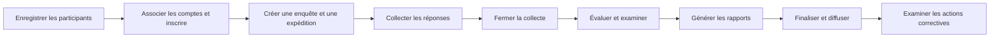

# Référentiel des exigences fonctionnelles

[English](../functional-requirements.md)

Ce référentiel décrit ePT 7.6.21 à partir de son implémentation et des guides de travail existants.
Il sert de base à la revue du programme. Il ne constitue pas un cahier des charges approuvé.
Les contrôles d'acceptation figurent dans le [dossier de validation](validation.md).

## Périmètre et utilisateurs

ePT gère les programmes d'essais d'aptitude (PT). Les données concernent les participants,
les échantillons PT, les réponses, l'évaluation et le retour aux participants.
Le diagnostic des patients et la gestion courante de leurs résultats sont hors périmètre.

| Acteur | Besoin | Périmètre |
| --- | --- | --- |
| Administrateur PT | Gérer les cycles PT et examiner les résultats | Privilèges administratifs attribués au compte |
| Gestionnaire de données | Soumettre les résultats et obtenir les rapports | Participants associés au compte |
| Coordinateur national PT (PTCC) | Accompagner un réseau de participants | Gestionnaires de données et participants attribués |
| Participant | Recevoir une évaluation PT | Laboratoire, site de dépistage ou opérateur individuel représenté par une fiche participant |
| Opérateur technique | Maintenir l'installation | Serveur, base de données, application et tâches planifiées |

Une fiche participant et un compte de connexion sont des entités distinctes.
Un gestionnaire de données peut représenter plusieurs participants.
Consultez le [guide d'administration, en anglais](../AdminModuleGuide.md#user-roles).

## Exigences et cas d'utilisation

Les identifiants ci-dessous servent aux revues et aux tests. Ils n'impliquent pas une approbation des parties prenantes.

| ID | Exigence utilisateur | Processus et résultat observable |
| --- | --- | --- |
| FR-01 | Les administrateurs tiennent à jour les participants | Créer, modifier et importer les fiches avec les identifiants du programme |
| FR-02 | Les administrateurs attribuent les accès | Associer les gestionnaires de données aux participants et configurer les privilèges administratifs |
| FR-03 | Les administrateurs inscrivent les participants | Inscrire les participants aux programmes et aux expéditions |
| FR-04 | Les administrateurs configurent les cycles PT | Créer une enquête PT, ajouter les expéditions et définir les échantillons et résultats de référence |
| FR-05 | Les administrateurs configurent l'évaluation | Choisir les paramètres, algorithmes et règles de notation pris en charge |
| FR-06 | Les gestionnaires de données identifient les tâches en attente | Consulter les expéditions des participants associés et leurs dates d'échéance |
| FR-07 | Les gestionnaires de données déclarent les résultats PT | Soumettre les résultats propres au programme, les dates de test et les champs justificatifs requis |
| FR-08 | Les gestionnaires de données déclarent l'impossibilité de tester | Enregistrer une déclaration de test non réalisé séparément d'une réponse avec test réalisé |
| FR-09 | Les administrateurs contrôlent l'accès aux réponses | Fermer la collecte et examiner les soumissions tardives prises en charge |
| FR-10 | Les administrateurs évaluent les réponses | Comparer les réponses aux données de référence avec l'évaluateur configuré |
| FR-11 | Les administrateurs examinent les exceptions | Examiner les exclusions, les absences de réponse, les commentaires d'évaluation et les interventions manuelles |
| FR-12 | Les administrateurs publient les rapports | Générer, examiner et finaliser les rapports avant leur diffusion aux participants |
| FR-13 | Les gestionnaires de données obtiennent le retour d'évaluation | Télécharger les rapports individuels et récapitulatifs disponibles |
| FR-14 | L'équipe du programme suit les cycles | Examiner les rapports de participation, de réponse et de performance |
| FR-15 | L'équipe du programme communique | Mettre en file les notifications d'expédition et les autres messages pris en charge |
| FR-16 | Les clients autorisés échangent des données | Utiliser les routes API implémentées pour les programmes et fonctions pris en charge |
| FR-17 | Les opérateurs techniques maintiennent le système | Installer, migrer, mettre à jour, sauvegarder et restaurer l'application |
| FR-18 | L'équipe du programme examine l'activité enregistrée | Consulter les historiques d'audit et de connexion pour les événements enregistrés |

## Limites du processus

Les valeurs de référence relèvent du fournisseur PT. Le choix de la présentation du rapport
ne définit pas l'algorithme national de test. La configuration du programme et les paramètres
de l'instance déterminent le comportement de l'évaluation.

Le traitement automatique des échéances peut fermer la collecte et mettre l'évaluation en file.
La revue et la finalisation des rapports restent des tâches administratives.
Le traitement des soumissions tardives dépend du parcours de saisie et du délai de grâce configuré.
Il n'autorise pas toutes les soumissions après l'échéance.

## Échanges de données

| Échange | Contenu | Limite |
| --- | --- | --- |
| Import de feuilles de calcul | Fiches participants et inscriptions | Les modèles et règles de validation des imports s'appliquent |
| Soumission web des résultats | Réponses PT et champs documentaires | Les formulaires du programme et l'état de l'expédition s'appliquent |
| API | Référentiels, expéditions, réponses et métadonnées des rapports | La couverture varie selon le programme et le point d'accès |
| Export de rapports | Rapports PDF et synthèses sous forme de feuilles de calcul | La publication et l'accès dépendent de l'état du processus |
| Courriel | Notifications et communications relatives aux rapports | Le service SMTP et le traitement de la file sont des dépendances externes |

L'[inventaire API](api-reference.md) indique les routes implémentées.
Il ne prouve pas qu'un pays a connecté un système externe particulier.

## Décisions restant à prendre par le programme

Le responsable de l'installation fournit les programmes actifs, les algorithmes, les identifiants locaux
et les champs obligatoires. Il fournit aussi les formats de rapport, les rôles autorisés et la liste des intégrations locales.
Il approuve les critères d'acceptation et les écarts par rapport à ce référentiel.

## Sources de l'implémentation

Sources : `application/services/Participants.php`, `Shipments.php`, `Evaluation.php`,
`Reports.php`, `ApiServices.php`, les modèles des programmes et `scheduled-jobs/process-shipment-deadlines.php`.
Les procédures détaillées figurent dans le [parcours de formation, en anglais](../training/README.md).
