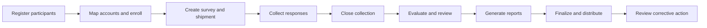

# Functional requirements baseline

This reference describes ePT 7.6.21 from the implementation and existing workflow guides.
It is a baseline for programme review, not a signed user requirements specification.
Acceptance checks appear in the [validation package](validation.md).

## Scope and users

ePT manages proficiency testing programmes. Its records concern participants, PT samples,
responses, evaluation and feedback. Patient diagnosis and routine patient-result management
are outside this scope.

| Actor | Need | Scope |
| --- | --- | --- |
| PT administrator | Run PT rounds and review outcomes | Administrative privileges assigned to the account |
| Data manager | Submit results and obtain reports | Mapped participants |
| PT country coordinator (PTCC) | Support a participant network | Assigned data managers and participants |
| Participant | Receive a PT assessment | Laboratory, testing site or individual tester represented by a participant record |
| Technical operator | Maintain the installation | Server, database, application and scheduled jobs |

A participant record and a login account are different entities. A data manager can
represent several participants. See [the admin guide](AdminModuleGuide.md#user-roles).

## Requirements and use cases

The IDs below identify review and test cases. They do not imply stakeholder approval.

| ID | User requirement | Workflow and observable outcome |
| --- | --- | --- |
| FR-01 | Administrators maintain participants | Create, edit and import participant records with programme identifiers |
| FR-02 | Administrators assign access | Map data managers to participants and configure administrative privileges |
| FR-03 | Administrators enroll participants | Register participants for schemes and individual shipments |
| FR-04 | Administrators configure PT rounds | Create a survey, add shipments and define samples and reference results |
| FR-05 | Administrators configure evaluation | Select supported scheme settings, algorithms and scoring parameters |
| FR-06 | Data managers identify pending work | View shipments for mapped participants and their response deadlines |
| FR-07 | Data managers report PT results | Submit scheme-specific results, testing dates and required supporting fields |
| FR-08 | Data managers declare inability to test | Record a not-tested declaration separately from a tested response |
| FR-09 | Administrators control response access | Close response collection and review supported late submissions |
| FR-10 | Administrators evaluate responses | Compare responses with reference data using the configured scheme evaluator |
| FR-11 | Administrators review exceptions | Review exclusions, non-response, evaluation comments and manual interventions |
| FR-12 | Administrators release reports | Generate, review and finalize reports before participant distribution |
| FR-13 | Data managers obtain feedback | Download available individual and summary reports |
| FR-14 | Programme staff monitor rounds | Review participation, response and performance reports |
| FR-15 | Programme staff communicate | Queue shipment notifications and other supported participant messages |
| FR-16 | Authorized clients exchange data | Use implemented API routes for supported schemes and participant functions |
| FR-17 | Technical operators maintain the system | Install, migrate, update, back up and restore the application |
| FR-18 | Programme staff review recorded activity | Consult application audit and login history where events are recorded |

## Workflow boundaries

Reference values belong to the PT provider. Report layout selection does not define
the national testing algorithm. Scheme configuration and instance settings govern
evaluation behaviour.

Automatic deadline processing can close response collection and queue evaluation.
Report review and finalization remain administrator tasks. Late-submission behaviour
depends on the response path and configured grace period. It is not universal permission
to submit after a deadline.

## Data exchange

| Exchange | Content | Boundary |
| --- | --- | --- |
| Spreadsheet import | Participant and enrollment records | Template and import validation rules apply |
| Web result submission | PT response and documentation fields | Scheme-specific forms and shipment state apply |
| API | Reference data, shipments, responses and report metadata | Coverage differs by scheme and endpoint |
| Report export | PDF reports and spreadsheet summaries | Publication and account access depend on workflow state |
| Email | Notifications and report communications | SMTP service and queue processing are external dependencies |

The [API inventory](api-reference.md) identifies implemented routes. It does not establish
that a country has connected a particular external system.

## Programme decisions still required

The installation owner supplies the active schemes, algorithms, local identifiers,
required fields, reporting formats, authorized roles and local integration list.
The owner also approves acceptance criteria and any differences from this baseline.

## Implementation sources

Source areas: `application/services/Participants.php`, `Shipments.php`, `Evaluation.php`,
`Reports.php`, `ApiServices.php`, scheme models, and `scheduled-jobs/process-shipment-deadlines.php`.
Detailed procedures appear in the [training curriculum](training/README.md).
